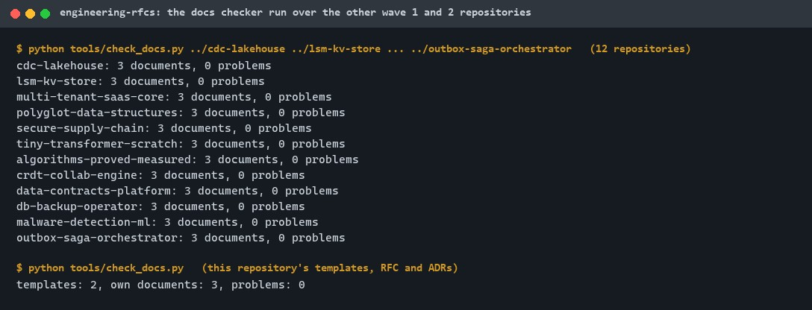
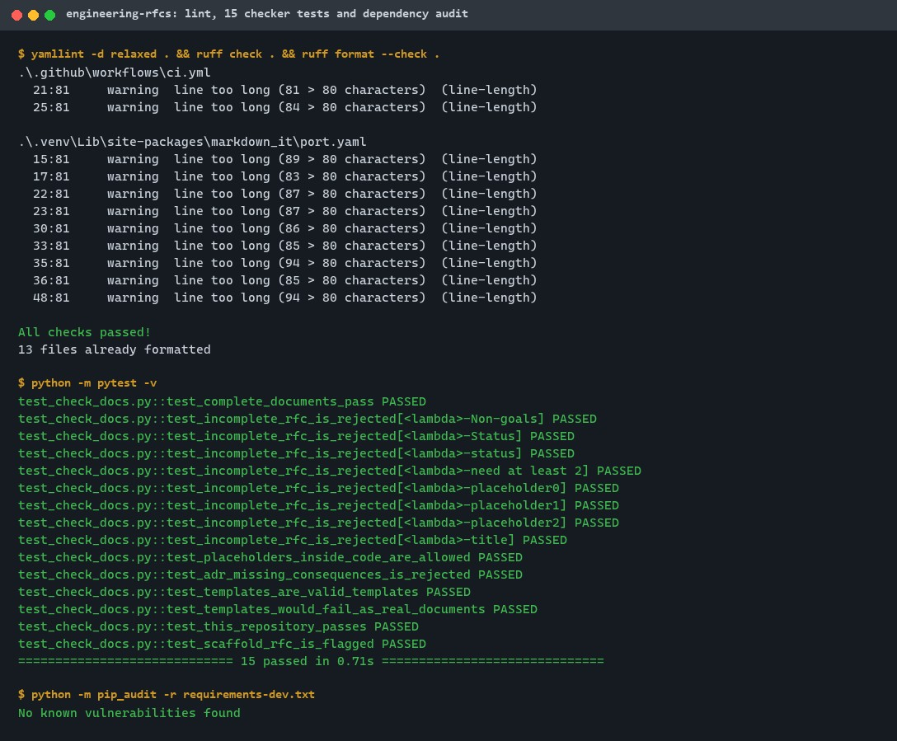
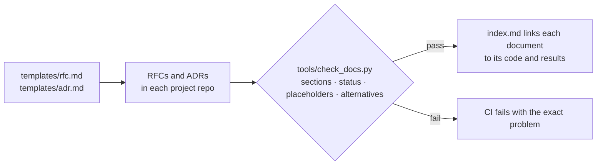
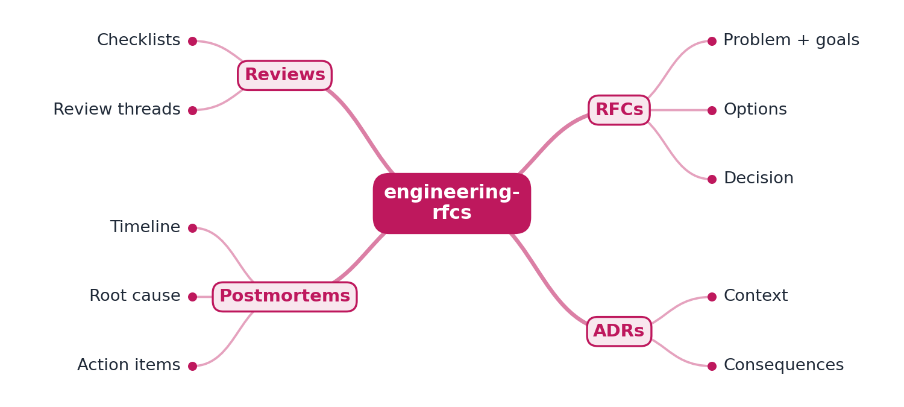
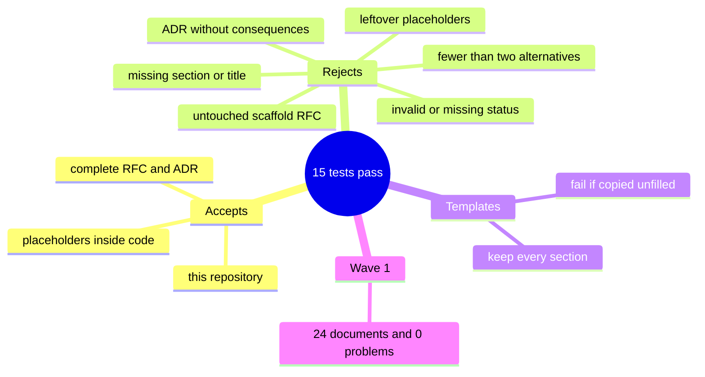

# engineering-rfcs

[](https://github.com/EquinoxWN/engineering-rfcs/actions/workflows/ci.yml)


> The design writing behind the code: RFC and ADR templates, a review process, an index of every project's design documents, and a checker that fails CI on missing sections or leftover placeholders.

Part of my **CS Foundations** list · Markdown

## Proof it works

The structural checker this repository ships, run over the twelve other wave 1 and 2 project repositories: every RFC and ADR has its required sections, no unfilled placeholders and valid links. Then its own templates and documents:



Lint is clean, 15 checker tests pass, and the dev dependencies have no known vulnerabilities:



## Architecture

**What M1 runs today:**



**Full roadmap (M1 to M3):**



## How it works

_Steps 1, 2, 5 and 6 are built and tested; the rest is on the [roadmap](#roadmap)._

1. Every flagship repo gets an RFC written before building: problem, goals, non-goals, options and the chosen design.
2. Decisions made during the build are captured as short ADRs with their consequences.
3. Design reviews happen in public PR threads, where you answer critique, ideally from real peers.
4. Chaos drills and fuzzing finds become blameless postmortems.
5. Templates and a review checklist show how you would raise the bar for a team.
6. An index links every document to the code it shaped.

## Who it helps

- **Who:** Engineers and teams who write design documents.
- **The problem:** Design docs get skipped, or ship with empty sections and placeholders that no reviewer catches.
- **How to use it:** Copy the RFC and ADR templates and the review checklist, and run the checker in CI so a document with missing sections or leftover placeholders fails the build.

## Tech stack

| Area | In M1 | Planned |
|---|---|---|
| Docs | Markdown with Mermaid diagrams | - |
| Templates | RFC, ADR, reviewer checklist in process.md | Postmortem template |
| Checks | Python checker (`tools/check_docs.py`), yamllint, ruff, GitHub Actions | - |
| Record | - | GitHub Discussions and PR review threads |

Language: **Markdown**, plus a small Python checker.

| Path | What it is |
|---|---|
| [`process.md`](process.md) | When to write an RFC, ADR or postmortem; lifecycle; what reviewers check |
| [`templates/rfc.md`](templates/rfc.md), [`templates/adr.md`](templates/adr.md) | Starting points with every required section |
| [`index.md`](index.md) | Every project's RFC, ADRs, code and results in one table |
| `tools/check_docs.py` | Fails on missing sections, invalid status, leftover placeholders, or fewer than two alternatives |

## Run it

Needs Python 3.11 or newer.

```bash
make setup   # pytest, ruff, yamllint
make lint    # yamllint and ruff
make check   # check the templates and this repository's own RFC and ADRs
make test    # checker tests
```

Check other projects cloned next to this one:

```bash
make check-repos REPOS="../lsm-kv-store ../cdc-lakehouse"
```

Start a new design: copy `templates/rfc.md` to `<project>/docs/rfc/NNNN-<topic>.md`, follow [`process.md`](process.md), and add a row to [`index.md`](index.md).

## Tests and results

Latest run (full detail in [docs/results/m1.md](docs/results/m1.md)):

| Check | Result |
|---|---|
| Checker tests | 15 passed, 0 failed |
| Wave 1 and 2 design documents checked | 42 (14 RFCs, 28 ADRs) |
| Problems found in the finished wave | 0 |
| Problems caught during the wave | scaffold placeholder RFCs in 3 repositories, before they were written |

### Test map



## Roadmap

**M1** (≈8 h)
- [x] Write `docs/rfc/0001-design.md`: problem, goals, non-goals, chosen design
- [x] Every flagship repo gets an RFC written before building: problem, goals, non-goals, options and the chosen design.
- [x] Decisions made during the build are captured as short ADRs with their consequences.

**M2** (≈8 h)
- [ ] Design reviews happen in public PR threads, where you answer critique, ideally from real peers.
- [ ] Chaos drills and fuzzing finds become blameless postmortems.

**M3** (≈9 h)
- [x] Templates and a review checklist show how you would raise the bar for a team.
- [x] An index links every document to the code it shaped.
- [ ] Publish the proof below with real numbers

## Proof

What this repo must show before it counts as done:

- A reader can trace one flagship from RFC to code to postmortem.

| Result | Value |
|---|---|
| M3 proof above | Not measured yet (M3). Current M1 numbers: see [Tests and results](#tests-and-results). |

## Why it matters

- **Interview angle:** Staff behavioural rounds: 'tell me about a technical decision you drove and its trade-offs'.
- **Upstream I'd like to contribute to:** A real RFC process: review comments on a Kubernetes KEP or a Rust RFC.

## Design docs

- [RFC 0001: design](docs/rfc/0001-design.md)
- [ADR 0001: record architecture decisions](docs/adr/0001-record-architecture-decisions.md)
- [ADR 0002: lint design documents in CI](docs/adr/0002-lint-documents-in-ci.md)

## Scope

This is a learning and portfolio system, not a hosted production service. Everything runs locally.

## Security and contributing

- Every GitHub Action is pinned to a commit SHA; workflows run read-only, without persisted credentials.
- Dependabot proposes dependency and action updates weekly.
- `ruff` with security (bandit) rules and `ruff format --check` on every push; `pip-audit` (`make audit`) in CI.
- Report vulnerabilities privately: see [SECURITY.md](SECURITY.md). To contribute, see [CONTRIBUTING.md](CONTRIBUTING.md).

## License

MIT, see [LICENSE](LICENSE).
